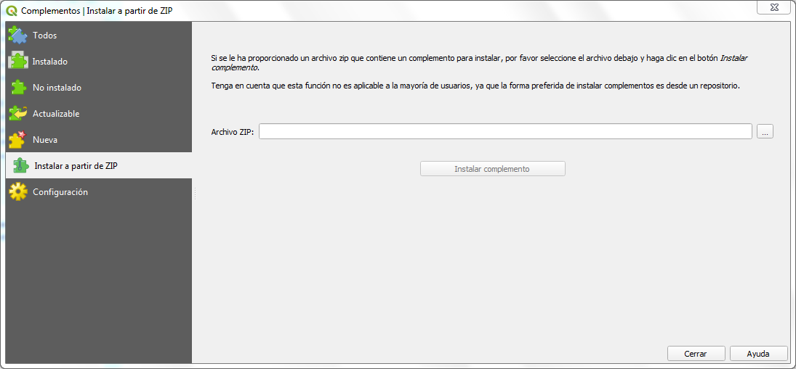
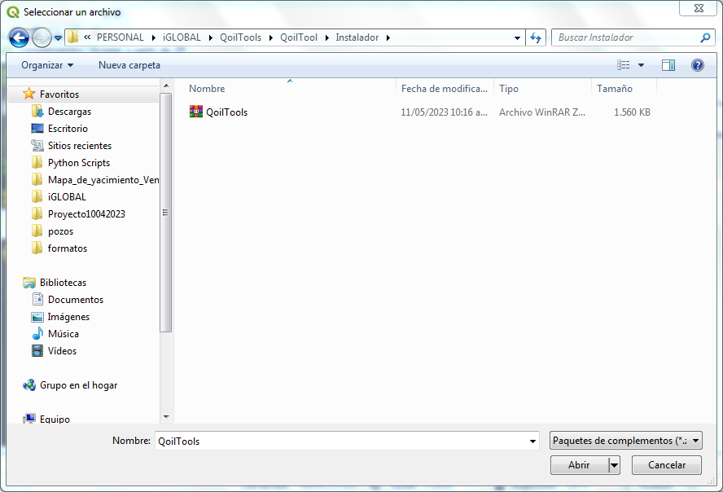
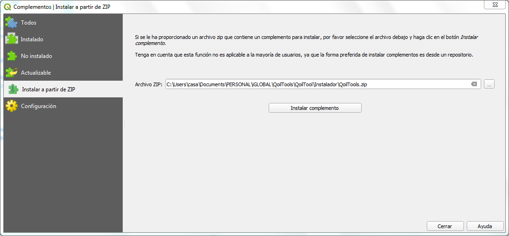
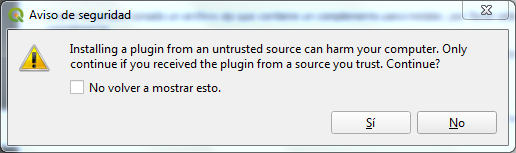

# Generalidades
Generalidades del complemento QoilTools  

   Sobre el Complemento  
   =====================  
   QoilTools es el complemento principal del entorno que facilita el uso de QGIS en la caracterización de yacimientos. Potencial el uso y tratamiento de la información de subsuelo generada o de fuentes externas, su categorización, asignación de estilos, cartografiado, presentación y certificación, resguardo eficiente en Bases de Datos, Geopackage, Geojson, Shape File, entre otros. Todo esto,  a través de una interfaz sencilla e intuitiva, maximizando la eficiencia de los algoritmos nativos de QGIS y propios, junto a elemento como las librerías de simbologías necesarias en la industria de O&G. EL entorno que conforma QoilTools y QGIS facilitan el acceso a la información a un mayor grupo de usuarios, permite el seguimiento, actualización y oficialización de los datos con el máximo de seguridad y confidencialidad, adicionalmente consolida el uso de información digital válida y certificada, reduciendo el uso de impresiones en papel.  
   
   Lenguaje  
   ========  
   Los códigos de QoilTools está escrito en lenguaje **Python**, las ventanas fueron creadas en **Qt5**.  

   Desarrollador  
   =============  
   Tanto QoilTools, QMapSymbolVE, QMapSymbol, las librerías y todo lo relacionado al entorno que permite potenciar a QGIS como la herramienta para trabajar con datos de subsuelo y superficie en la caracterización y explotación de yacimientos en la industria de O&G fue realizado por el Geólogo Aldo Sardelli asardelli@gmail.com  

   Instalación  
   ===========  
   El complemento solo está disponible para ser instalado a través de un archivo ZIP en “Administrar e instalar complementos”.  

   

  

- Se selecciona Instalar a partir de ZIP.
- Se busca la carpeta comprimida QoilTools.zip.

  

- Seleccionado el archivo instalador se activa el botón “Instalar complemento”

  

  

- Se hace clic y aparece un mensaje *La instalación de un complemento de una fuente no confiable puede dañar su computadora. Continúe solo si recibió el complemento de una fuente confiable. ¿Continuar?.*

  

  

- Clic sobre el botón *Si*.

  **¡Listo! El complemento fue instalado.**

  
