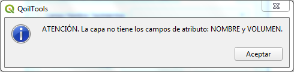

# Generalidades
Generalidades del complemento QoilTools  

   Sobre el Complemento  
   =====================  
   
QoilTools es el complemento principal del entorno que facilita el uso de QGIS en la caracterización de yacimientos. Potencial el uso y tratamiento de la información de subsuelo generada o de fuentes externas, su categorización, asignación de estilos, cartografiado, presentación y certificación, resguardo eficiente en Bases de Datos, Geopackage, Geojson, Shape File, entre otros. Todo esto,  a través de una interfaz sencilla e intuitiva, maximizando la eficiencia de los algoritmos nativos de QGIS y propios, junto a elemento como las librerías de simbologías necesarias en la industria de O&G. EL entorno que conforma QoilTools y QGIS facilitan el acceso a la información a un mayor grupo de usuarios, permite el seguimiento, actualización y oficialización de los datos con el máximo de seguridad y confidencialidad, adicionalmente consolida el uso de información digital válida y certificada, reduciendo el uso de impresiones en papel.
  
   
   Lenguaje  
   ========  
   Los códigos de QoilTools está escrito en lenguaje **Python**, las ventanas fueron creadas en **Qt5**.  

   Desarrollador  
   =============  
   
Tanto QoilTools, QMapSymbolVE, QMapSymbol, las librerías y todo lo relacionado al entorno que permite potenciar a QGIS como la herramienta para trabajar con datos de subsuelo y superficie en la caracterización y explotación de yacimientos en la industria de O&G fue realizado por el Geólogo Aldo Sardelli asardelli@gmail.com
  

   Instalación  
   ===========  
   El complemento solo está disponible para ser instalado a través de un archivo ZIP en “Administrar e instalar complementos”.  

   

  

- Se selecciona Instalar a partir de ZIP.
- Se busca la carpeta comprimida QoilTools.zip.

  

- Seleccionado el archivo instalador se activa el botón “Instalar complemento”

  

  

- Se hace clic y aparece un mensaje *La instalación de un complemento de una fuente no confiable puede dañar su computadora. Continúe solo si recibió el complemento de una fuente confiable. ¿Continuar?.*

  

  

- Clic sobre el botón *Si*.

  **¡Listo! El complemento fue instalado.**

  Variables
  =========
  Para mejorar la experiencia con la interfaz se debe definir una variable Global ***user_country*** al momento de la instalación.  

  

  

Procedimiento para agregarla:
- En el menú Configuración, Opciones se hace clic y aparece la ventana de opciones.

  

  

- Se hace clic en el símbolo más (+) en color verde ubicado en la parte inferior derecha.

  

  

- Al hacer clic, se agrega una nueva variable a la que se le asigna el nombre ***user_country*** y como valor ***Venezuela***.

**¡Listo! La variable a sido agregada.**  

  

  

   Procesos  
   ========  
   El complemento cuenta con 55 procesos distribuidos en 16 botones:  

•	Crear capa nueva (QoilCn)  
•	Transformar puntos a líneas (QoilCo)  
•	Transformar líneas a polígono (QoilCo)  
•	Transformar polígonos a líneas (QoilCo)  
•	Transformar líneas a puntos (QoilCo)  
•	Cargar pozos por lotes (QoilCp)  
•	Cargar un pozo (QoilCp)  
•	Definir parámetros geológicos (QoilDg)  
•	Crear Yacimiento (QoilYo)  
•	Buscar pozos por yacimientos (QoilYo)  
•	Definir acumulación (QoilDa)   
•	Calculo de azimut (QoilDe)  
•	Plano de referencia de yacimientos (QoilDe)  
•	Espacio cero (QoilDe)  
•	Transferir Valores Máx/Mín (QoilTf)  
•	Transferir Datos (QoilTf)  
•	Inspector de Rangos (QoilTf)  
•	Ajuste de Valle y Cima (QoilTf)  
•	Calcular área (QoilAr)  
•	Cálculo de Espesor Promedio (QoilVo)  
•	Cálculo de volumen (QoilVo)  
•	Transferir valor (QoilVo)  
•	Tabla Resumen (QoilVo)  
•	Unir Capas (QoilUn)  
•	Agregar objetos a capa (QoilUn)  
•	Dividir capa (QoilDi)  
•	Copiar Atributo de una capa a otra (QoilCa)  
•	Cálculo Dinámico (QoilUt)  
•	Campo Nuevo (QoilUt)  
•	Transformar Partes (QoilUt)  
•	Cambiar el Nombre a la Capa (QoilUt)  
•	Constante (QoilUt)  
•	Constante Numérica (QoilUt)  
•	Incremental (QoilUt)  
•	Constante con Incremental (QoilUt)  
•	Fecha Actual (yyyy/MM/dd) (QoilUt)  
•	Hora (HH/mm/ss) (QoilUt)  
•	Fecha y Hora Actual (QoilUt)  
•	Fecha Específica (yyyy/MM/dd) (QoilUt)  
•	Operación entre un Campo A y un Campo B (QoilUt)  
•	Operación entre un Campo A y una constante numérica (QoilUt)  
•	Borra atributos de un campo (QoilUt)  
•	Agregar un Punto por Coordenadas (QoilUt)  
•	Agregar Puntos, una Línea o un Polígono por coordenadas (QoilUt)  
•	Corregir geometrías (QoilUt)  
•	Agregar Alias a los campos de atributos (QoilUt)  
•	Quitar Alias (QoilUt)  
•	Asignar Alias (Sobrenombre) individual (QoilUt)  
•	Quitar Alias (Sobrenombre) individual (QoilUt)  
•	Mostrar la ubicación de la capa (QoilUt)  
•	Evaluar las geometrías (QoilUt)  
•	Evaluar campos (QoilUt)  
•	Mostrar Tabla de Atributos (QoilTa)  
•	Eliminar capa(s) seleccionadas (QoilEl)  

   Botones
   =======  
   QoilTools cuenta con 16 botones de los cuales 14 abren una ventana y 2 ejecutan un proceso directo.  

| Nombre | Símbolo Botón | Ventana/Directo | Pestañas | N° Procesos |
| :---: | :---: | :---: | :---: | :---: |
| QoilUn |   | Ventana | 1 | 1 |
| QoilCo |  | Ventana | 2 | 4 |
| QoilCp |  | Ventana | 2 | 2 |
| QoilDg |  | Ventana | 1 | 1 |
| QoilYo |  | Ventana | 2 | 2 |
| QoilDa |  | Ventana | 1 | 1 |
| QoilDe |  | Ventana | 3 | 3 |
| QoilTf |  | Ventana | 3 | 4 |
| QoilAr |  | Ventana | 1 | 1 |
| QoilVo |  | Ventana | 4 | 4 |
| QoilUn |  | Ventana | 2 | 2 |
| QoilDi |  | Ventana | 1 | 1 |
| QoilCa |  | Ventana | 1 | 1 |
| QoilUt |  | Ventana | 5 | 25 |
| QoilTa |  | Directo | 1 | 1 |
| QoilEl |  | Directo | 1 | 1 |

   Accesibilidad  
   =============  
   El acceso desde el sistema se puede hacer a través de la barra de menu, una Barra de herramienta, Barra de menú en la parte superior de panel de capas y un sub-menu en el menú de la capa (botón derecho del mouse).
   - ## Menú
     Todas las ventanas de QoilTools pueden accederse a través de menú ***QoilTools*** en la barra de menu de QGIS. adicioanlmente es donde se encuentran los manuales de uso del complemento.

     

  

  

   - ## Barra de Herramientas
     Se denomina ***QoilTools*** y abre todas las ventanas y ejecuta los dos procesos directos de abrir la Tabla de Atributros y eliminar la(s) capas seleccionadas.

  

  
   
   Los botones en la barra de herramienta están agrupados en cinco grupos:
   - El primero contiene los procesos de creación de información vectorial primaria (QoilCn, QoilCo y QoilCp).
   - El segundo grupo está orientado a caracterización geológica, creación de yacimientos y su definición, así como análisis estructural (QoilDg, QoilYo, QoilDa y QoilDe).
   - El tercer grupo asociado a cálculo de área y volumen con algunas herramientas para transferir información (QoilTf, QoilAr y QoilVo).
   - Un cuarto grupo contentivo de procesos para agregar y transformar información (QoilUn, QoilDi, QoilCa y QoilUt).
   - Finalmente, el quinto grupo donde se encuentran los botones de procesos directos, para abrir la Tabla de Atributos y eliminar la(s) capas seleccionadas (QoilTa y QoilEl).
   
  - ## Barra de herramienta del panel de capas
    En esta barra ubicada en la parte superior del panel de capas se pueden encontrar los botones que ejecutan procesos directos como Abrir Tabla de Atributo (QoilTa) y Elimina la(s) capas seleccionadas (QoilEl).

  

  

   - ## Sub-menú en el menú de la capa
     
Este menu se encuentra al al hacer clic con el botón derecho del mouse y se encuentran los tres procesos de uso frecuente para las capas vectoriales: Crear capa vector a partir de otra (QoilCo), Definir parámetros geológicos (QoilDg) y Herramientas adicionales (QoilUt), dentro de un menu llamado ***QoilTools***.

  

  

   Tips
   ====
   Cada ventana cuenta con tips que indican el uso o concepto necesario para entender la variable. Son mostrados al posar el puntero sobre cualquier elemento de la ventana.  

A continuación, los enlaces si desea conocer los tips para cada ventana, recuerde que la posición de la etiqueta de los tips no siempre son las mostrada en las imágenes.

[Ventana QoilCn](img/Ge_29.png)  
[Ventana QoilCo Pestaña 1](img/Ge_30.png)  
[Ventana QoilCo Pestaña 2](img/Ge_31.png)  
[Ventana QoilCp Pestaña 1](img/Ge_32.png)  
[Ventana QoilCp Pestaña 2](img/Ge_33.png)  
[Ventana QoilDg](img/Ge_34.png)  
[Ventana QoilYo Pestaña 1](img/Ge_35.png)  
[Ventana QoilYo Pestaña 2](img/Ge_36.png)  
[Ventana QoilDa](img/Ge_37.png)  
[Ventana QoilDe Pestaña 1](img/Ge_38.png)  
[Ventana QoilDe Pestaña 2](img/Ge_39.png)  
[Ventana QoilDe Pestaña 3](img/Ge_40.png)  
[Ventana QoilTf Pestaña 1](img/Ge_41.png)  
[Ventana QoilTf Pestaña 2](img/Ge_42.png)  
[Ventana QoilTf Pestaña 3](img/Ge_43.png)  
[Ventana QoilAr](img/Ge_44.png)  
[Ventana QoilVo Pestaña 1](img/Ge_45.png)  
[Ventana QoilVo Pestaña 2](img/Ge_46.png)  
[Ventana QoilVo Pestaña 3](img/Ge_47.png)  
[Ventana QoilVo Pestaña 4](img/Ge_48.png)  
[Ventana QoilUn Pestaña 1](img/Ge_49.png)  
[Ventana QoilUn Pestaña 2](img/Ge_50.png)  
[Ventana QoilDi](img/Ge_51.png)  
[Ventana QoilCa](img/Ge_52.png)  
[Ventana QoilUt Pestaña 1](img/Ge_53.png)  
[Ventana QoilUt Pestaña 2](img/Ge_54.png)  
[Ventana QoilUt Pestaña 3](img/Ge_55.png)  
[Ventana QoilUt Pestaña 4](img/Ge_56.png)  
[Ventana QoilUt Pestaña 5](img/Ge_57.png)  

   Proceso Intuitivos  
   ==================
   Las ventanas del complemento QoilTools cuentan con un sistema intuitivo para ayudar al usuario a definir los parámetros requeridos de manera correcta. Los cuales se describen a continuación:  

   - ## Activación de Check
   
Los Check se activarán cuando sea seleccionado el parámetro que lo define, tales como: escribir el nombre de un campo, seleccionar el tipo de campo, seleccionar una capa, seleccionar el tipo de archivo, o abrir el explorador para guardar un archivo.
  
   De la misma manera se deseleccionará cuando la asignación o selección de algún parámetro vuelve a su estado inicial.
   - ## Sugerencias
   En los parámetros de nombre de capa o nombre de archivo el sistema sugerirá uno según el nombre o tipo de la capa de entrada.

   - ## Sistema de semáforo  
   Dependiendo de la selección de los parámetros, el sistema indicará a taves de colores en el botón de ejecución o la etiqueta asociada al parámetro.
     Estos elementos cambiarán entre los colores ***Amarillo***, ***Rojo*** y ***Verde***.
     El color amarillo indica que los parámetros no han sido completados.  
	

  

   El color Rojo indica que un parametros es incorrecto, no válido o incompleto por lo que el proceso no podra ejecutarse.  
     

  

   Cuando las etiquetas y/o el botón de ejecutar cambia su color a verde, indica que el parámetro es correcto, que todos los requerimeintos fueron cumplidos y el proceso se ejecutara correctamente.  

  

  

   Mensajes de Alertas y errores  
   =============================  
   QoilTools cuenta con un conjunto de mensajes clasificado de acuerdo a su origen en: Critico, Precaución, Informativo y Confirmación. A continuación, se presentan cada uno de ellos indicando la(s) ventana donde se podrían mostrar:  
	
   - ### Mensajes Acción Critica  
	

  

 

Ventanas QoilCn, QoilCo, QoilCp, QoilYo.  

  

 

Ventanas QoilCn, QoilCa, QoilUt.  

  

 

Ventanas QoilCn, QoilCo,QoilDg, QoilYo, QoilTf, QoilUn, QoilDi, QoilCa, QoilUt.  

  

 

Ventana QoilCp. 

  

 

Ventana QoilCp. 

  

 

Ventana QoilCp. 

  

 

Ventana QoilYo. 

  

 

Ventanas QoilYo, QoilDe, QoilAr, QoilVo, QoilUn, QoilDi, QoilCa. 

  

 

Ventana QoilDa. 

  

 

Ventana QoilDa. 

  

 

Ventana QoilDa. 

  

 

Ventanas QoilDa, QoilDa, QoilTf, QoilUt. 

  

 

Ventana QoilVo.  

  

 

Ventana QoilVo.  

  

 

Ventana QoilVo.  

  

 

Ventana QoilVo.  

  

 

Ventana QoilUn.  

  

 

Ventana QoilCa.  

  

 

Ventana QoilUt.  

  

 

Ventana QoilUt. 

  

 

Ventana QoilUt. 

   - ### Mensajes de Precaución  

  

 

Ventanas QoilCn, QoilUn.  

  

 

Ventanas QoilCn, QoilCo, QoilCp, QoilDg, QoilYo, QoilDa.  

  

 

Ventana QoilYo.  

  

 

Ventana QoilYo.  

  

 

Ventana QoilYo.  

  

 

Ventana QoilYo.  

  

 

Ventana QoilDe.  

  

 

Ventana QoilDe.  

  

 

Ventana QoilDe.  

  

 

Ventana QoilTf.  

  

 

Ventana QoilTf.  

  

 

Ventana QoilUn.  

  

 

Ventana QoilDi.  

  

 

Ventana QoilUt.  

  

 

Ventana QoilUt.  

  

 

Ventana QoilUt.  

  

 

Ventana QoilUt.  

  

 

Ventana QoilUt.  

   - ## Mensajes de Información

  

 

Ventana QoilCp.  

  

 

Ventana QoilYo.  

  

 

Ventana QoilDa.  

  

 

Ventanas QoilTf, QoilAr, QoilVo, QoilDi.  

  

 

Ventana QoilTf.  

  

 

Ventana QoilVo.  

  

 

Ventana QoilVo.  

  

 

Ventana QoilVo.  

  

 

Ventana QoilVo.  

  

 

Ventana QoilVo.  

  

 

Ventana QoilVo.  

  

 

Ventana QoilVo.  

  

 

Ventana QoilUn.  

  

 

Ventana QoilUn.  

  

 

Ventana QoilDi.  

  

 

Ventana QoilCa.  

  

 

Ventana QoilCa.  

  

 

Ventana QoilUt.  

   - ## Mensajes de Confirmación

  

 

Ventana QoilYo.  

  

 

Ventanas QoilAr,QoilVo.  

  

 

Ventana QoilVo.  

  

 

Ventana QoilDi.  

  

 

Ventana QoilDi.  

  

  

Ventana QoilUt.  

 

Ventana QoilUt.  

  

 

Ventana QoilUt.  

   - ## Otros  
   ATENCIÓN. No se puede ejecutar.\nRevisa la selección de los parámetros.  
Ventana QoilVo  
   ATENCIÓN. Capa Buscar No Valida.  
Ventana QoilYo  
   ATENCIÓN. Revise los parámetros.  
Ventana QoilAr  
   ATENCIÓN. La capa Transferir no es válida.  
   ATENCIÓN. No se puede ejecutar.\nRevise los parámetros Max y Min o no existe un Campo de atributo ID.  
   ATENCIÓN. No hay objetos espaciales seleccionados.\nPresione el botón "Mostrar".  
Ventana QoilTf  
   ATENCIÓN. No se pudo generar el archivo.  
   ATENCIÓN. Capa de referencia No Válida.  
   ATENCIÓN. Capa intersección No Válida.  
Ventana QoilDe  
	
   Manuales
   ========
   Se prepararon 6 manuales de uso, segmentados para mejorar la experiencia con el usuario.
	
   [1.	Generalidades del complemento]()  
   [2.	Manual QoilCn QoilCo QoilCp](https://github.com/asardelli/Manual_QoilCn_QoilCo_QoilCp.git)  
   [3.	Manual QoilDg QoilYo QoilDa QoilDe](https://github.com/asardelli/Manual_QoilDg_OoilYo_QoilDa_QoilDe.git)  
   [4.	Manual QoilTf QoilAr QoilVo](https://github.com/asardelli/Manual_QoilTf_QoilAr_QoilVo.git)  
   [5.	Manual QoilUn QoilDi QoilCa](https://github.com/asardelli/Manual_QoilUn_QoilDi_QoilCa.git)  
   [6.	Manual QoilUt](https://github.com/asardelli/Manual_QoilUt.git)  

