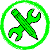

# Generalidades
Generalidades del complemento QoilTools  

   Sobre el Complemento  
   =====================  
   QoilTools es el complemento principal del entorno que facilita el uso de QGIS en la caracterización de yacimientos. Potencial el uso y tratamiento de la información de subsuelo generada o de fuentes externas, su categorización, asignación de estilos, cartografiado, presentación y certificación, resguardo eficiente en Bases de Datos, Geopackage, Geojson, Shape File, entre otros. Todo esto,  a través de una interfaz sencilla e intuitiva, maximizando la eficiencia de los algoritmos nativos de QGIS y propios, junto a elemento como las librerías de simbologías necesarias en la industria de O&G. EL entorno que conforma QoilTools y QGIS facilitan el acceso a la información a un mayor grupo de usuarios, permite el seguimiento, actualización y oficialización de los datos con el máximo de seguridad y confidencialidad, adicionalmente consolida el uso de información digital válida y certificada, reduciendo el uso de impresiones en papel.  
   
   Lenguaje  
   ========  
   Los códigos de QoilTools está escrito en lenguaje **Python**, las ventanas fueron creadas en **Qt5**.  

   Desarrollador  
   =============  
   Tanto QoilTools, QMapSymbolVE, QMapSymbol, las librerías y todo lo relacionado al entorno que permite potenciar a QGIS como la herramienta para trabajar con datos de subsuelo y superficie en la caracterización y explotación de yacimientos en la industria de O&G fue realizado por el Geólogo Aldo Sardelli asardelli@gmail.com  

   Instalación  
   ===========  
   El complemento solo está disponible para ser instalado a través de un archivo ZIP en “Administrar e instalar complementos”.  

   

  

- Se selecciona Instalar a partir de ZIP.
- Se busca la carpeta comprimida QoilTools.zip.

  

- Seleccionado el archivo instalador se activa el botón “Instalar complemento”

  

  

- Se hace clic y aparece un mensaje *La instalación de un complemento de una fuente no confiable puede dañar su computadora. Continúe solo si recibió el complemento de una fuente confiable. ¿Continuar?.*

  

  

- Clic sobre el botón *Si*.

  **¡Listo! El complemento fue instalado.**

  Variables
  =========
  Para mejorar la experiencia con la interfaz se debe definir una variable Global ***user_country*** al momento de la instalación.  

  

  

Procedimiento para agregarla:
- En el menú Configuración, Opciones se hace clic y aparece la ventana de opciones.

  

  

- Se hace clic en el símbolo más (+) en color verde ubicado en la parte inferior derecha.

  

  

- Al hacer clic, se agrega una nueva variable a la que se le asigna el nombre ***user_country*** y como valor ***Venezuela***.

**¡Listo! La variable a sido agregada.**  

  

  

   Procesos  
   ========  
   El complemento cuenta con 55 procesos distribuidos en 16 botones:  

•	Crear capa nueva (QoilCn)  
•	Transformar puntos a líneas (QoilCo)  
•	Transformar líneas a polígono (QoilCo)  
•	Transformar polígonos a líneas (QoilCo)  
•	Transformar líneas a puntos (QoilCo)  
•	Cargar pozos por lotes (QoilCp)  
•	Cargar un pozo (QoilCp)  
•	Definir parámetros geológicos (QoilDg)  
•	Crear Yacimiento (QoilYo)  
•	Buscar pozos por yacimientos (QoilYo)  
•	Definir acumulación (QoilDa)  
•	Cálculo de Datos Estructurales (QoilDe)  
•	Calculo de azimut (QoilDe)  
•	Plano de referencia de yacimientos (QoilDe)  
•	Espacio cero (QoilDe)  
•	Transferir Valores Máx/Mín (QoilTf)  
•	Transferir Datos (QoilTf)  
•	Inspector de Rangos (QoilTf)  
•	Ajuste de Valle y Cima (QoilTf)  
•	Calcular área (QoilAr)  
•	Cálculo de Espesor Promedio (QoilVo)  
•	Cálculo de volumen (QoilVo)  
•	Transferir valor (QoilVo)  
•	Tabla Resumen (QoilVo)  
•	Unir Capas (QoilUn)  
•	Agregar objetos a capa (QoilUn)  
•	Dividir capa (QoilDi)  
•	Copiar Atributo de una capa a otra (QoilCa)  
•	Cálculo Dinámico (QoilUt)  
•	Campo Nuevo (QoilUt)  
•	Transformar Partes (QoilUt)  
•	Cambiar el Nombre a la Capa (QoilUt)  
•	Constante (QoilUt)  
•	Constante Numérica (QoilUt)  
•	Incremental (QoilUt)  
•	Constante con Incremental (QoilUt)  
•	Fecha Actual (yyyy/MM/dd) (QoilUt)  
•	Hora (HH/mm/ss) (QoilUt)  
•	Fecha y Hora Actual (QoilUt)  
•	Fecha Específica (yyyy/MM/dd) (QoilUt)  
•	Operación entre un Campo A y un Campo B (QoilUt)  
•	Operación entre un Campo A y una constante numérica (QoilUt)  
•	Borra atributos de un campo (QoilUt)  
•	Agregar un Punto por Coordenadas (QoilUt)  
•	Agregar Puntos, una Línea o un Polígono por coordenadas (QoilUt)  
•	Corregir geometrías (QoilUt)  
•	Agregar Alias a los campos de atributos (QoilUt)  
•	Quitar Alias (QoilUt)  
•	Asignar Alias (Sobrenombre) individual (QoilUt)  
•	Quitar Alias (Sobrenombre) individual (QoilUt)  
•	Mostrar la ubicación de la capa (QoilUt)  
•	Evaluar las geometrías (QoilUt)  
•	Evaluar campos (QoilUt)  
•	Mostrar Tabla de Atributos (QoilTa)  
•	Eliminar capa(s) seleccionadas (QoilEl)  

   Botones
   =======  
   QoilTools cuenta con 16 botones de los cuales 14 abren una ventana y 2 ejecutan un proceso directo.  

| Nombre | Símbolo Botón | Ventana/Directo | Pestañas | N° Procesos |
| :---: | :---: | :---: | :---: | :---: |
| QoilUn |   | Ventana | 1 | 1 |
| QoilCo |  | Ventana | 2 | 4 |
| QoilCp |  | Ventana | 2 | 2 |
| QoilDg |  | Ventana | 1 | 1 |
| QoilYo |  | Ventana | 2 | 2 |
| QoilDa |  | Ventana | 1 | 1 |
| QoilDe |  | Ventana | 3 | 3 |
| QoilTf |  | Ventana | 3 | 4 |
| QoilAr |  | Ventana | 1 | 1 |
| QoilVo |  | Ventana | 4 | 4 |
| QoilUn |  | Ventana | 2 | 2 |
| QoilDi |  | Ventana | 1 | 1 |
| QoilCa |  | Ventana | 1 | 1 |
| QoilUt |  | Ventana | 5 | 25 |
| QoilTa |  | Directo | 1 | 1 |
| QoilEl |  | Directo | 1 | 1 |

   Accesibilidad  
   =============  
   El acceso desde el sistema se puede hacer a través de la barra de menu, una Barra de herramienta, Barra de menú en la parte superior de panel de capas y un sub-menu en el menú de la capa (botón derecho del mouse).
   - ## Menú
     Todas las ventanas de QoilTools pueden accederse a través de menú ***QoilTools*** en la barra de menu de QGIS. adicioanlmente es donde se encuentran los manuales de uso del complemento.

     

  

  
